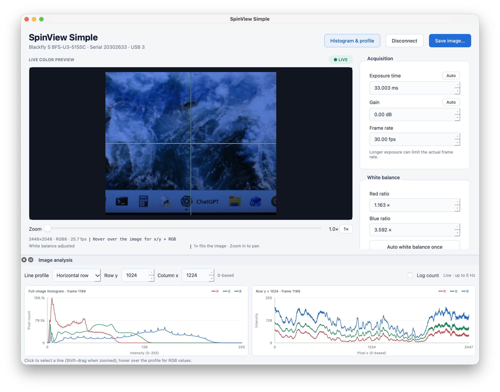

# SpinView Simple

The code in this project was generated by OpenAI Codex.

A native macOS camera-control app for the FLIR/Teledyne Blackfly S BFS-U3-51S5C.
Provides live color preview, image saving, camera controls, full-image RGB
histograms, and selectable horizontal or vertical RGB profiles.



## Launch

Connect the camera with a USB 3 data cable, close SpinView or any other app using
the camera, and double-click **Start SpinView.command**. The app connects
automatically with **30 fps** requested and **33 ms** exposure on every connection.
Alternatively, from this project directory:

```bash
.venv/bin/python app.py
```

The launcher uses this project's Python environment, so activating it manually
is unnecessary. Keep the launcher alongside the project files and `.venv`.

## Camera controls

- **Connection:** connects automatically at launch. Use **Disconnect**
  to stop acquisition or **Connect camera** to reconnect after an unplug or error.
- **Exposure time:** entered in milliseconds, with **33 ms** requested on each
  connection. The camera's range is read live.
- **Gain:** entered in decibels.
- **Auto exposure / Auto gain:** click **Auto** beside the corresponding field
  to let the camera adjust that parameter once. The field shows the changing
  value while adjusting, then returns to manual control with the chosen value.
  The other parameter stays manual. It uses the camera's configured brightness
  target and automatic adjustment limits. If the scene cannot reach that target,
  adjustment stops after a timeout and keeps the latest value. Fresh SDK
  readbacks detect completion and update the manual controls with the camera's
  current values.
- **Frame rate:** sets the requested acquisition rate, initially **30 fps** on
  each connection. Exposure and USB throughput may limit the actual rate.
  For example, a 300 ms exposure limits
  acquisition to approximately 3.3 fps even with a higher requested rate.
- **White balance:** adjust red and blue channel ratios manually, or use
  **Auto white balance once** with a well-lit neutral target. Auto adjustment
  temporarily locks the ratio controls and then returns them to manual mode.

The app uses manual exposure/gain and continuous, untriggered acquisition while
connected. It briefly pauses acquisition to apply setting changes and displays
the values read back from the camera. Original camera settings are restored
when disconnecting or quitting, when the camera remains accessible. It never
saves a persistent camera user set. Adjustments are therefore session-only.

## Preview

- **Live color image:** initially fits the full image without stretching or
  cropping. Acquisition runs in a separate thread. Preview updates are capped
  at 30 fps; the footer reports the measured rate at which frames are received.
- **Zoom and pan:** use the slider below the image to magnify the fitted view
  from **1× to 8×**, in 0.1× steps. Click **1×** to reset zoom and recenter the
  full image. When zoomed in, drag with the left mouse button to pan. The view
  stays in place as live frames arrive. Connecting again or changing image
  dimensions resets the view. Here, 1× means fit to the preview area, rather
  than one screen pixel per sensor pixel.
- **Pixel readout:** hover over the image to see its original **x, y**
  coordinates and **R, G, B** values below the preview. Coordinates start at
  (0, 0) in the top-left; RGB values range from 0 to 255. The readout follows
  new frames even while the pointer is still and works with the analysis panel
  hidden. Moving outside the image clears it; overlays do not change its values.
- **Center crosshair:** toggles a cyan overlay anchored to the image center,
  including while zooming or panning. It is enabled by default.
- **Compact information:** two lines below the zoom controls show image
  dimensions, RGB8 format, received frame rate, pointer coordinates/RGB values,
  camera status, and interaction hints, separated by `|` and `·`. Hover over a
  shortened status message or hint to read its full text.
- **Last-frame inspection:** after disconnecting, the last frame remains visible
  and is labeled **Last frame**. Zoom, pan, pixel readouts, analysis, and image
  saving remain available.

## Image saving

Use **Save image…**, **File → Save image…**, or **Command-S** to save the frame
shown when the command was invoked at full 2448 × 2048 resolution.

| Format | Extensions | Pixel preservation |
| --- | --- | --- |
| TIFF | `.tif`, `.tiff` | Lossless RGB8 |
| PNG | `.png` | Lossless RGB8 |
| BMP | `.bmp` | Lossless RGB8 |
| JPEG | `.jpg`, `.jpeg` | Lossy, quality 95 |

Snapshots contain processed color pixels, not raw Bayer or 16-bit sensor data.
Zoom, pan, the center crosshair, and the profile guide do not affect saved images.
The last frame can also be saved after disconnecting.

## Image analysis

- **Panel controls:** **Histogram & profile** or **View → Image analysis** toggles
  the panel, shown by default below the preview. Use its float button to place
  the plots in a separate window. Hiding the panel stops new analysis requests.
- **Full-image histogram:** counts every pixel in a full-resolution processed
  RGB8 frame, with separate red, green, and blue curves across intensity bins
  0–255. Each channel totals 5,013,504 pixels at 2448 × 2048. Enable **Log count**
  to make smaller histogram peaks easier to see.
- **Line profile:** choose **Horizontal row** or **Vertical column**. Enter
  **Row y** (0–2047) or **Column x** (0–2447) for this camera, or click on the
  preview. At 1×, dragging selects a line; when zoomed, use **Shift-drag** to
  select while ordinary dragging pans. Coordinates start at zero at the top-left.
  The amber dashed guide marks the selected row or column; the cyan center
  crosshair is separate.
- **Pixel values:** hover over the profile to read the pixel position and its
  exact red, green, and blue values (0–255). Profile axes use original image
  coordinates, regardless of the preview's displayed size.
- **Live and offline use:** a background worker samples the latest displayed
  full-resolution frame up to five times per second. It does not analyze every
  acquired frame. Chart titles identify the completed analysis frame and line.
  After disconnecting, you can still select and inspect lines in the last frame.

Statistics use processed RGB8 pixels, not raw Bayer or 16-bit sensor samples.
Preview overlays never affect histogram counts, profiles, or saved images.
Zoom and pan change only the displayed view: analysis and image saving keep the
full-resolution source image. Pixel readouts and profile guides follow original
image coordinates, and the center crosshair remains anchored to the image center.
This feature uses the existing NumPy and PySide6 dependencies.

## Environment

Validated on Apple Silicon with Python 3.12:

- Native Spinnaker SDK **4.4.0.246**
- Homebrew: `ffmpeg@6`, `libusb`, `libomp`
- Project `.venv`: PySpin **4.4.0.246**, NumPy **2.5.3**, PySide6 **6.11.2**

The PySpin wheel must match the native SDK version, Python ABI, and architecture.
The matching package on this Mac is:

```text
/Applications/Spinnaker/PySpin/spinnaker_python-4.4.0.246-cp312-cp312-macosx_14_0_arm64.tar.gz
```

No OpenCV, Matplotlib, or Pillow installation is required. `requirements.txt`
records the tested Python versions; install the vendor wheel before using it
to reproduce the environment.

### Set up a fresh checkout

First install Python 3.12 and the Apple Silicon Spinnaker 4.4.0.246 SDK from
[Teledyne](https://www.teledynevisionsolutions.com/products/spinnaker-sdk/).
Then, from the project directory:

```bash
brew install ffmpeg@6 libusb libomp
python3.12 -m venv .venv
mkdir -p .venv/vendor-wheel
tar -xzf /Applications/Spinnaker/PySpin/spinnaker_python-4.4.0.246-cp312-cp312-macosx_14_0_arm64.tar.gz \
  -C .venv/vendor-wheel \
  spinnaker_python-4.4.0.246-cp312-cp312-macosx_14_0_arm64.whl
.venv/bin/python -m pip install .venv/vendor-wheel/*.whl
.venv/bin/python -m pip install -r requirements.txt
.venv/bin/python app.py
```

The vendor archive contains the wheel and SDK documentation. The SDK, Python
wheel, and virtual environment are not included in this repository.

## Checks

```bash
.venv/bin/python check_camera.py
QT_QPA_PLATFORM=offscreen .venv/bin/python -m unittest discover -s tests -v
```

The readiness check enumerates cameras without changing settings. The current
suite has **95 passing tests**, covering lossless image round trips,
full-resolution saving, display-only overlays, UI control units/readback,
fresh SDK auto-control state, exact RGB histogram totals and line profiles,
click/drag coordinate mapping, live preview and profile hover readouts,
stationary-pointer updates across frame and window changes, zoom/pan coordinate
mapping and reset, coalesced background requests, stale-result rejection after
reconnecting, shutdown, and SDK cleanup on failure.

Hardware validation on the connected BFS-U3-51S5C confirmed live RGB8 frames,
all five manual controls, approximately 20 fps at a 20 fps target with a suitable
exposure, successful TIFF/PNG snapshots, clean shutdown, and restoration of the
original settings. One-shot white balance was verified to start; convergence
depends on a suitably illuminated neutral target.

Three automatic-exposure trials returned to manual control in approximately
**1 second**; automatic gain completed in approximately **0.7 seconds**. These
timings depend on the scene and camera settings. Live analysis validation confirmed all
5,013,504 pixels per channel, 2448-sample horizontal profiles, and 2048-sample
vertical profiles. A separate full-resolution computation benchmark measured
approximately **22 ms median** per analysis on this Mac; this is computation time,
not a guarantee of camera or display frame rate.
